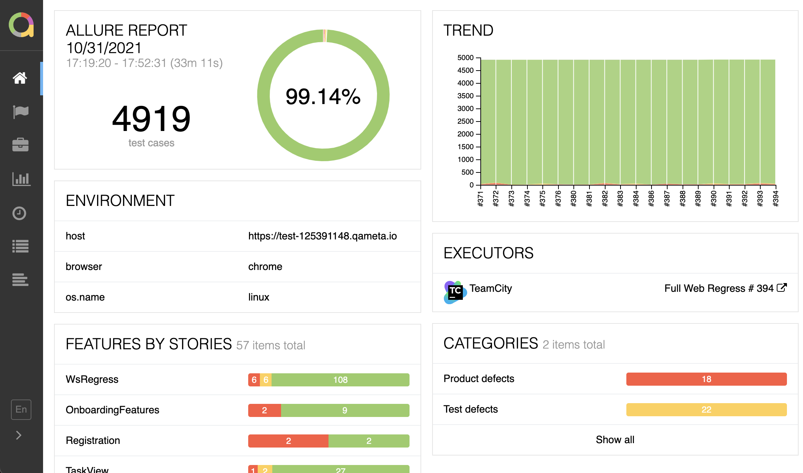

# Allure

> Generate and publish Allure reports from Jenkins builds.

- Learn more about Allure Report at [https://allurereport.org](https://allurereport.org)
- 📚 [Documentation](https://allurereport.org/docs/) – discover official documentation for Allure Report
- ❓ [Questions and Support](https://github.com/orgs/allure-framework/discussions/categories/questions-support) – get help from the team and community
- 📢 [Official announcements](https://github.com/orgs/allure-framework/discussions/categories/announcements) –  stay updated with our latest news and updates
- 💬 [General Discussion](https://github.com/orgs/allure-framework/discussions/categories/general-discussion) – engage in casual conversations, share insights and ideas with the community
- 🖥️ [Live Demo](https://demo.allurereport.org/) — explore a live example of Allure Report in action

## Getting Started

This plugin allows you to create Allure reports as part of your Jenkins builds. You can then view the generated report directly in Jenkins or download it to your machine.

To learn more, please visit [the official documentation](https://allurereport.org/docs/integrations-jenkins/).

### Allure installations

Configure one **Allure** tool in **Manage Jenkins → Tools**. New installations use
**Recommended Allure 3** by default. Users who need to stay on Allure 2 can choose
**Recommended Allure 2**. Recommended versions are tested and pinned in each plugin release;
upgrading the plugin advances installations using either recommended policy. Choose
**Fixed version** to pin an exact Allure 2.x or 3.x release instead.

For recommended Allure 3 installations, the plugin:

- bundles the platform-independent Allure runtime in the plugin;
- installs a private Node.js runtime on the agent without changing the build's Node.js or `PATH`;
- supports glibc-based Linux, macOS, and Windows agents on x64 and ARM64; and
- stores immutable, versioned releases so an upgrade cannot replace a runtime used by an active build.

The controller downloads each Node.js archive once, verifies its pinned SHA-256 checksum, and
caches it under
`$JENKINS_HOME/caches/allure-plugin/node/<node-version>/<platform>/<sha256>/`. Subsequent agent
installations reuse that cache. The Allure runtime itself does not require network access in
recommended mode.

The first recommended installation still needs the Node.js archive. For restricted or offline
Jenkins environments, either configure a controller-accessible HTTP(S) or `file:` mirror with the
official Node.js distribution layout, or pre-seed the cache path above with the correctly named
official archive. A mirror base such as `https://mirror.example/node` must contain files below
`v<node-version>/node-v<node-version>-<platform>.<archive-extension>`.

Other installation choices are available in the same tool configuration:

- A recommended or fixed Allure 2 version is downloaded from Maven Central or a configured controller-accessible
  HTTPS Maven mirror and runs with Java on the agent. Managed downloads require the matching
  `.zip.sha256` sidecar, reject unsafe archive paths, and enforce archive size limits.
- A fixed Allure 3 version uses the plugin-managed private Node.js runtime and installs the exact
  package from an HTTPS npm registry on the agent. The first resolution creates a package lock;
  subsequent installations reuse that lock and run `npm ci`. Before installation, the plugin
  requires an npm v3 lock with the exact Allure version, HTTPS package URLs, and SHA-512 integrity
  for every package. Its npm download and lock caches are retained below the tool home.
- To use a pre-installed commandline, clear **Install automatically** and set **Home** to an
  extracted Allure 2 directory or an Allure 3 npm prefix (the directory containing `bin/allure`,
  or the `bin` directory itself). The plugin detects the installed version on each agent.

Existing Allure 2 tool records and jobs using the released Allure 3-from-`PATH` option remain
compatible. The legacy Allure 3 tool is no longer offered for new configuration. Alpine and other
musl-based agents should use a locally installed Allure commandline because official Node.js
binaries target glibc.

### Advanced Threshold Policies

Overview
 - The plugin can now assess build stability using:
 - Percentage-based thresholds
 - Absolute failure-count thresholds
 - Aggregated evaluation in matrix builds
 - Optional preservation of the original Jenkins build result

This functionality is fully backward-compatible. Existing pipelines continue to operate without modification unless new parameters are explicitly provided.

### Parameters
| Parameter                       | Description                                                             |
|---------------------------------|-------------------------------------------------------------------------|
| `unstableThresholdPercent`      | Marks build **UNSTABLE** if % of failed tests ≥ threshold               |
| `failureThresholdPercent`       | Marks build **FAILURE** if % of failed tests ≥ threshold                |
| `failureThresholdCount`         | Marks build **FAILURE** if number of failed tests ≥ threshold           |
| `resultPolicy` (`DEFAULT`, `LEAVE_AS_IS`) | Controls whether Allure modifies the final build result      |
| `results`                        | Supports glob patterns for multi-axis builds (e.g., `**/allure-results`) |

Compatibility Notes
 - If no threshold parameters are provided, the plugin uses its original behavior.
 - Thresholds apply only when Allure results are present and successfully generated.
 - This feature does not alter the reporting format or Allure commandline behavior.

## Useful links

* [Issues](https://github.com/jenkinsci/allure-plugin/issues?labels=&milestone=&page=1&state=open)
* [Releases](https://github.com/jenkinsci/allure-plugin/releases)

## Contact us

* Mailing list: [allure@qameta.io](mailto:allure@qameta.io)
* StackOverflow tag: [Allure](http://stackoverflow.com/questions/tagged/allure)
